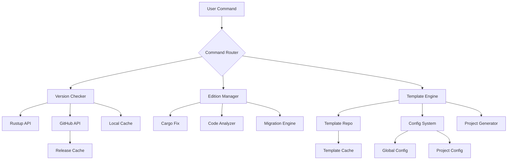

# Ferrous Forge Feature Plan: Rust Version & Edition Management System
## Version 2.0 Major Feature Enhancement

---

## Executive Summary

This document outlines the comprehensive plan for enhancing Ferrous Forge to become a complete Rust ecosystem management tool that helps developers maintain up-to-date, best-practice-compliant Rust projects. The new features will include version checking, edition compliance, migration assistance, and template-based project initialization.

---

## Core Features

### 1. Rust Version Management 🦀

#### 1.1 Version Detection & Checking
- **Module**: `src/rust_version.rs`
- **Functionality**:
  - Detect currently installed Rust version via `rustc --version`
  - Parse installed toolchains via `rustup toolchain list`
  - Compare against latest stable/beta/nightly releases
  - Check MSRV (Minimum Supported Rust Version) compliance

#### 1.2 GitHub Release Integration
- **Module**: `src/github_releases.rs`
- **API Endpoints**:
  - `https://api.github.com/repos/rust-lang/rust/releases/latest`
  - `https://api.github.com/repos/rust-lang/rust/tags`
- **Features**:
  - Cache release data locally (24hr TTL)
  - Parse semantic versions and release notes
  - Identify security updates and breaking changes
  - Recommend stable versions based on project requirements

#### 1.3 Update Assistant
- **Commands**:
  - `ferrous-forge rust check` - Check current version status
  - `ferrous-forge rust update` - Guide through update process
  - `ferrous-forge rust recommend` - Suggest best version for project
- **Integration**: Work with rustup to manage toolchains

---

### 2. Edition Compliance & Migration 📚

#### 2.1 Edition Detection
- **Module**: `src/edition_manager.rs`
- **Features**:
  - Scan Cargo.toml for edition field
  - Detect deprecated/outdated edition usage
  - Check for edition-specific feature compatibility
  - Analyze code for edition-specific patterns

#### 2.2 Migration Assistant
- **Module**: `src/migration_assistant.rs`
- **Based on Rust Edition Guide**: https://doc.rust-lang.org/stable/edition-guide/
- **Features**:
  - Pre-migration analysis and report
  - Automated `cargo fix --edition` wrapper with enhanced error handling
  - Step-by-step migration guide generation
  - Rollback capability with automatic backups
  - Handle special cases:
    - Macro migrations
    - Documentation test updates
    - Build script modifications
    - Multi-configuration projects

#### 2.3 Edition-Specific Linting
- **Integration Points**:
  - rust-2021-compatibility lints
  - rust-2024-compatibility lints
  - Custom edition migration rules
- **Features**:
  - Incremental migration support
  - Workspace-wide edition consistency checking
  - Feature-gated code migration

---

### 3. Enhanced Configuration System 🔧

#### 3.1 Central Configuration Schema
```toml
# ~/.config/ferrous-forge/config.toml

[rust]
preferred_channel = "stable"  # stable/beta/nightly
auto_update_check = true
update_check_interval = "24h"
minimum_rust_version = "1.85.0"
preferred_edition = "2024"

[editions]
enforce_latest = true
allow_migration_prompts = true
backup_before_migration = true
migration_strategy = "incremental"  # all-at-once/incremental

[templates]
default_template = "standard"
template_repository = "https://github.com/ferrous-forge/templates"
auto_fetch_updates = true

[project_defaults]
edition = "2024"
rust_version = "1.85"
profile.dev.opt-level = 0
profile.release.opt-level = 3
profile.release.lto = true

[project_defaults.dependencies]
serde = { version = "1.0", features = ["derive"] }
tokio = { version = "1", features = ["full"] }

[project_defaults.dev-dependencies]
criterion = "0.5"
proptest = "1.0"

[project_defaults.lints.rust]
unsafe_code = "forbid"
missing_docs = "warn"

[project_defaults.lints.clippy]
all = "warn"
pedantic = "warn"
nursery = "warn"

[community_templates]
enabled = true
trusted_sources = [
  "https://github.com/ferrous-forge/templates",
  "https://github.com/rust-unofficial/patterns"
]
```

#### 3.2 Project-Specific Overrides
```toml
# ./ferrous-forge.toml (project root)

[project]
name = "my-awesome-project"
template = "web-service"
override_defaults = true

[rust]
minimum_version = "1.90.0"
edition = "2024"

[features]
enable_git_hooks = true
enable_doc_coverage = true
enable_security_audit = true

[custom_rules]
max_file_lines = 500
max_function_lines = 75
```

---

### 4. Template System 2.0 🎯

#### 4.1 Template Structure
```
templates/
├── standard/
│   ├── manifest.toml
│   ├── Cargo.toml.hbs
│   ├── src/
│   │   ├── main.rs.hbs
│   │   └── lib.rs.hbs
│   ├── .github/
│   │   └── workflows/
│   │       └── ci.yml.hbs
│   └── hooks/
│       ├── pre-init.sh
│       └── post-init.sh
├── web-service/
├── cli-tool/
├── library/
└── embedded/
```

#### 4.2 Template Manifest
```toml
# templates/web-service/manifest.toml

[template]
name = "web-service"
version = "1.0.0"
description = "Production-ready web service template"
author = "Ferrous Forge Community"
min_rust_version = "1.85.0"
edition = "2024"

[dependencies]
axum = "0.7"
tokio = { version = "1", features = ["full"] }
tower = "0.4"
tower-http = { version = "0.5", features = ["trace"] }
tracing = "0.1"
tracing-subscriber = "0.3"

[features]
database = ["sqlx", "sqlx-postgres"]
auth = ["jsonwebtoken", "argon2"]
metrics = ["prometheus", "metrics"]
```

#### 4.3 Community Template Sharing
- **Commands**:
  - `ferrous-forge template list` - Show available templates
  - `ferrous-forge template fetch <name>` - Download template
  - `ferrous-forge template publish` - Share template
  - `ferrous-forge template validate` - Check template validity

---

### 5. New CLI Commands 💻

```bash
# Version Management
ferrous-forge rust check              # Check Rust installation status
ferrous-forge rust update             # Update Rust to latest stable
ferrous-forge rust recommend          # Get version recommendations
ferrous-forge rust channels           # List available channels

# Edition Management  
ferrous-forge edition check           # Check project edition compliance
ferrous-forge edition migrate [2024]  # Migrate to specified edition
ferrous-forge edition lint            # Run edition-specific lints
ferrous-forge edition rollback        # Rollback last migration

# Template Management
ferrous-forge new <name> --template=web-service  # Create from template
ferrous-forge template list           # List available templates
ferrous-forge template fetch <name>   # Download template
ferrous-forge template create         # Create new template
ferrous-forge template validate       # Validate template

# Configuration
ferrous-forge config show             # Display current config
ferrous-forge config set <key> <val>  # Set configuration value
ferrous-forge config reset            # Reset to defaults
ferrous-forge config export           # Export shareable config
```

---

## Architecture Design

### Module Structure
```
src/
├── lib.rs
├── main.rs
├── cli.rs
├── config.rs (enhanced)
├── rust_version/
│   ├── mod.rs
│   ├── detector.rs      # Detect installed versions
│   ├── checker.rs       # Check against releases
│   └── updater.rs       # Update assistance
├── edition/
│   ├── mod.rs
│   ├── detector.rs      # Detect current edition
│   ├── analyzer.rs      # Analyze compatibility
│   ├── migrator.rs      # Migration engine
│   └── rollback.rs      # Rollback system
├── github/
│   ├── mod.rs
│   ├── client.rs        # GitHub API client
│   ├── releases.rs      # Release parsing
│   └── cache.rs         # Local caching
├── templates/
│   ├── mod.rs (enhanced)
│   ├── engine.rs        # Template engine
│   ├── manifest.rs      # Manifest parser
│   ├── repository.rs    # Template repo manager
│   └── validator.rs     # Template validation
└── commands/ (enhanced)
    ├── mod.rs
    ├── rust.rs          # Rust version commands
    ├── edition.rs       # Edition commands
    ├── template.rs      # Template commands
    └── new.rs          # Enhanced project creation
```

### Data Flow



---

## Integration Points

### 1. Rustup Integration
- Execute rustup commands via `std::process::Command`
- Parse rustup output for toolchain information
- Respect rustup's proxy and mirror configurations

### 2. Cargo Integration
- Wrap `cargo fix --edition` with enhanced error handling
- Parse Cargo.toml using `toml` crate
- Integrate with cargo metadata for project analysis

### 3. GitHub API
- Use authenticated requests for higher rate limits
- Implement exponential backoff for rate limiting
- Cache responses with configurable TTL

### 4. File System
- Atomic file operations for safety
- Automatic backups before modifications
- Rollback capability with git integration

---

## Implementation Phases

### Phase 1: Foundation (Week 1-2)
- [ ] Enhanced configuration system
- [ ] Basic rust version detection
- [ ] GitHub API client implementation
- [ ] Cache system for API responses

### Phase 2: Version Management (Week 3-4)
- [ ] Complete rust version checker
- [ ] Update recommendation engine
- [ ] Integration with rustup
- [ ] Version comparison logic

### Phase 3: Edition System (Week 5-6)
- [ ] Edition detection and analysis
- [ ] Migration wrapper for cargo fix
- [ ] Rollback system implementation
- [ ] Edition-specific lint integration

### Phase 4: Template Engine (Week 7-8)
- [ ] Template manifest parser
- [ ] Enhanced template engine
- [ ] Template repository management
- [ ] Community template support

### Phase 5: Testing & Documentation (Week 9-10)
- [ ] Comprehensive unit tests
- [ ] Integration tests
- [ ] Documentation updates
- [ ] Example templates creation

---

## Success Metrics

1. **Version Management**
   - Accurate detection of installed Rust versions
   - < 100ms version check time
   - 99.9% uptime for GitHub API integration

2. **Edition Migration**
   - 95% successful automatic migrations
   - Zero data loss during migrations
   - Rollback success rate > 99%

3. **Template System**
   - 10+ high-quality templates available
   - < 5 seconds project creation time
   - Community contribution support

4. **User Experience**
   - Clear, actionable CLI output
   - Helpful error messages with solutions
   - Progressive disclosure of complexity

---

## Risk Mitigation

### Technical Risks
1. **GitHub API Rate Limiting**
   - Solution: Implement caching, use authenticated requests
   
2. **Breaking Changes in Rust/Cargo**
   - Solution: Version detection, compatibility matrix
   
3. **Complex Migration Scenarios**
   - Solution: Manual intervention guides, community support

### User Experience Risks
1. **Overwhelming Complexity**
   - Solution: Progressive enhancement, sensible defaults
   
2. **Data Loss During Migration**
   - Solution: Automatic backups, rollback capability
   
3. **Network Dependencies**
   - Solution: Offline mode, cached data fallbacks

---

## Future Enhancements

### Version 2.1
- IDE integration (VSCode, IntelliJ)
- CI/CD pipeline templates
- Dependency update management

### Version 2.2
- Machine learning-based version recommendations
- Automated performance regression detection
- Cross-project dependency coordination

### Version 3.0
- Full Rust workspace management
- Distributed build caching
- Team collaboration features

---

## Resources & References

- [Rust Edition Guide](https://doc.rust-lang.org/stable/edition-guide/)
- [Cargo Documentation](https://doc.rust-lang.org/cargo/)
- [Rustup Documentation](https://rust-lang.github.io/rustup/)
- [GitHub REST API](https://docs.github.com/en/rest)
- [Rust RFC Repository](https://github.com/rust-lang/rfcs)

---

## Conclusion

This feature set will transform Ferrous Forge from a standards enforcer into a comprehensive Rust ecosystem management tool. By providing intelligent version management, seamless edition migration, and powerful template systems, we'll help developers maintain modern, best-practice Rust projects with minimal friction.

The phased implementation approach ensures we can deliver value incrementally while maintaining the high quality standards that Ferrous Forge represents.
