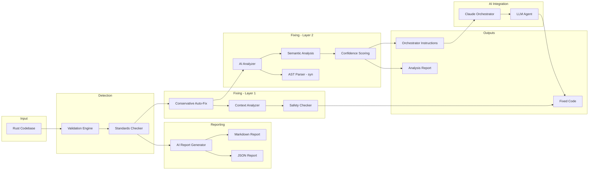
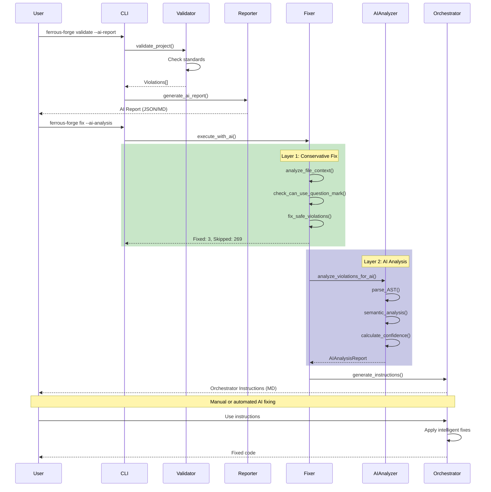
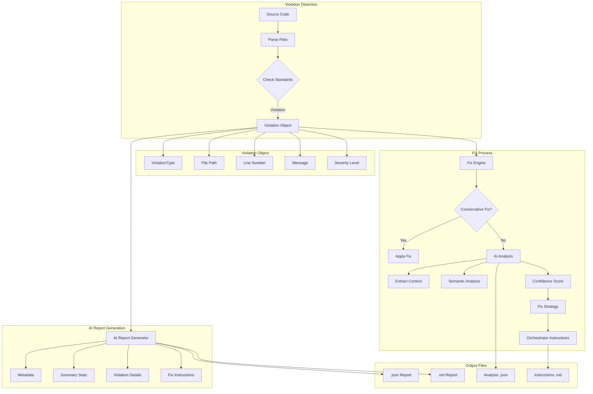

# Ferrous Forge Architecture Diagrams

## High-Level Flow



## Detailed Component Interaction



## Data Flow



## Fix Decision Tree

```mermaid
graph TD
    Start[Violation Detected] --> CheckType{Violation Type?}
    
    CheckType -->|UnwrapInProduction| CheckContext1[Check Context]
    CheckType -->|UnderscoreBandaid| CheckContext2[Check Context]
    CheckType -->|Other| Skip[Skip Auto-Fix]
    
    CheckContext1 --> IsTest{Test File?}
    IsTest -->|Yes| SkipTest[Skip - Tests OK]
    IsTest -->|No| HasResult{Returns Result?}
    
    HasResult -->|Yes| CanUseQ{Can Use '?'}
    HasResult -->|No| UseExpect[Convert to .expect()]
    
    CanUseQ -->|Yes| ApplyQ[Apply '?' Fix]
    CanUseQ -->|No| NeedContext{Has anyhow?}
    
    NeedContext -->|Yes| UseContext[Use .context()?]
    NeedContext -->|No| SkipNoContext[Skip - Need Manual]
    
    CheckContext2 --> IsTrait{Trait Method?}
    IsTrait -->|Yes| SkipTrait[Skip - Can't Modify]
    IsTrait -->|No| IsDropPattern{Drop Pattern?}
    
    IsDropPattern -->|Yes| SkipDrop[Skip - Intentional]
    IsDropPattern -->|No| ReturnsResult{Returns Result?}
    
    ReturnsResult -->|Yes| ApplyFix[Apply Fix]
    ReturnsResult -->|No| UseErrorHandle[if let Err(e)]
    
    Skip --> AIAnalysis[Run AI Analysis]
    SkipTest --> AIAnalysis
    SkipNoContext --> AIAnalysis
    SkipTrait --> AIAnalysis
    SkipDrop --> AIAnalysis
    
    AIAnalysis --> GenerateInstructions[Generate Instructions]
    GenerateInstructions --> Orchestrator[Claude Orchestrator]
```

## Confidence Score Calculation

```mermaid
graph LR
    Base[Base Score: 0.5] --> Check1{Has Function Name?}
    Check1 -->|Yes +0.1| Check2{Has Return Type?}
    Check1 -->|No| Check2
    
    Check2 -->|Yes +0.15| Check3{Has Function Calls?}
    Check2 -->|No| Check3
    
    Check3 -->|Yes +0.1| Check4{Has Error Imports?}
    Check3 -->|No| Check4
    
    Check4 -->|Yes +0.15| Final[Final Score]
    Check4 -->|No| Final
    
    Final --> Normalize[Min(score, 1.0)]
    Normalize --> Output[Confidence: 0.0-1.0]
```

## File System Structure

```
ferrous-forge/
├── src/
│   ├── validation.rs         # Core validation engine
│   ├── ai_analyzer.rs        # AI-powered analysis
│   └── commands/
│       ├── validate.rs       # Validate command + AI report
│       └── fix.rs            # Fix command (2-layer system)
│
├── .ferrous-forge/
│   ├── reports/              # AI compliance reports
│   │   ├── ai_compliance_*.json
│   │   ├── ai_compliance_*.md
│   │   ├── latest_ai_report.json
│   │   └── latest_ai_report.md
│   │
│   └── ai-analysis/          # AI analysis outputs
│       ├── ai_analysis_*.json
│       └── orchestrator_instructions_*.md
│
└── docs/
    ├── VIOLATION_FIX_FLOW.md
    └── ARCHITECTURE_DIAGRAM.md
```