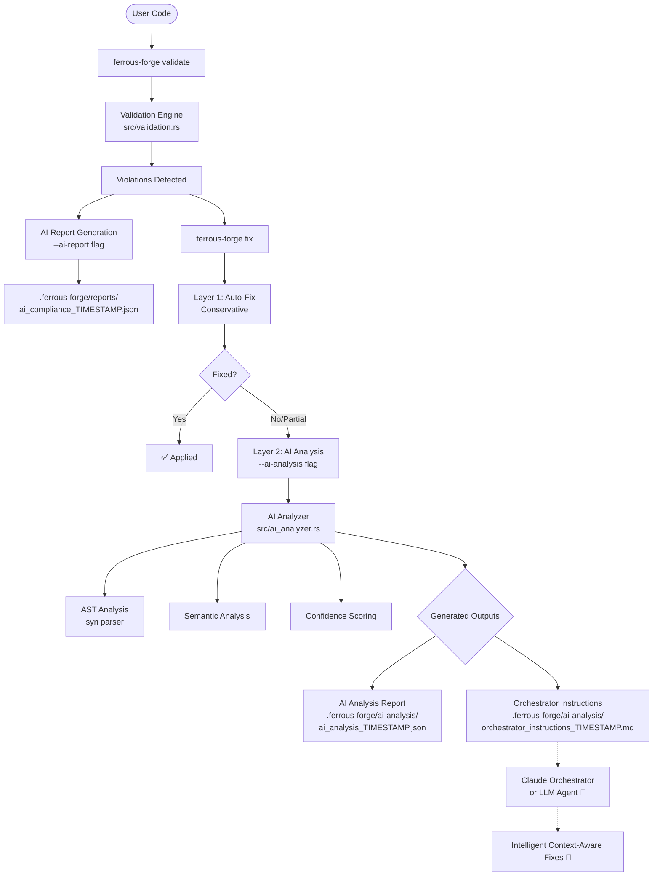

# Ferrous Forge Violation Detection and Fix Flow

> **Last Updated:** 2025-03-20  
> **Version:** 1.7.6  
> **Status:** ✅ Implemented (Current) / 🚧 Planned (v2.0+)

## Overview

Ferrous Forge implements a two-layer approach to detecting and fixing code violations:

1. **Layer 1: Conservative Auto-Fixes** - Safe, automated fixes that preserve compilation
2. **Layer 2: AI-Powered Analysis** - Deep semantic analysis that generates fix instructions for LLMs

## Architecture


```mermaid
graph TB
    Start([User Code]) --> Validate[ferrous-forge validate]
    
    Validate --> VE[Validation Engine<br/>src/validation.rs]
    VE --> Violations[Violations Detected]
    
    Violations --> AIReport[AI Report Generation<br/>--ai-report flag]
    AIReport --> AIReportFile[.ferrous-forge/reports/<br/>ai_compliance_TIMESTAMP.json]
    
    Violations --> Fix[ferrous-forge fix]
    Fix --> Layer1[Layer 1: Auto-Fix<br/>Conservative]
    
    Layer1 --> Fixed{Fixed?}
    Fixed -->|Yes| Success[✅ Applied]
    Fixed -->|No/Partial| Layer2[Layer 2: AI Analysis<br/>--ai-analysis flag]
    
    Layer2 --> AIAnalyzer[AI Analyzer<br/>src/ai_analyzer.rs]
    AIAnalyzer --> AST[AST Analysis<br/>syn parser]
    AIAnalyzer --> Semantic[Semantic Analysis]
    AIAnalyzer --> Confidence[Confidence Scoring]
    
    AIAnalyzer --> Outputs{Generated Outputs}
    Outputs --> AnalysisReport[AI Analysis Report<br/>.ferrous-forge/ai-analysis/<br/>ai_analysis_TIMESTAMP.json]
    Outputs --> Instructions[Orchestrator Instructions<br/>.ferrous-forge/ai-analysis/<br/>orchestrator_instructions_TIMESTAMP.md]
    
    Instructions -.-> Orchestrator[Claude Orchestrator<br/>or LLM Agent 🚧]
    Orchestrator -.-> IntelligentFix[Intelligent Context-Aware Fixes 🚧]
```

**Legend:**
- Solid lines (—): ✅ Currently implemented
- Dashed lines (-.-): 🚧 Planned for v2.0

## Core Components

### 1. Validation Engine (`src/validation/`)
- **Purpose**: Detects violations against Ferrous Forge standards
- **Entry Point**: `RustValidator::validate_project()`
- **Key Types**:
  - `ViolationType`: Enum of 12 violation types (UnderscoreBandaid, UnwrapInProduction, etc.)
  - `Violation`: Individual violation with file, line, message, severity
  - `RustValidator`: Main validation engine

**Implemented Checks:**
- File size (>300 lines)
- Function size (>50 lines)
- Line length (>100 chars)
- Underscore patterns (`_param`, `let _ =`)
- Unwrap/expect usage
- Edition compliance
- Documentation coverage
- Rust version

### 2. AI Report Generator (`src/commands/validate/ai_report.rs`)
- **Purpose**: Creates AI-friendly compliance reports
- **Location**: `.ferrous-forge/reports/`
- **Files**:
  - `ai_compliance_TIMESTAMP.json` - Structured violation data
  - `ai_compliance_TIMESTAMP.md` - Human-readable report
  - `latest_ai_report.json` - Symlink to latest
  - `latest_ai_report.md` - Symlink to latest

### 3. Fix Command (`src/commands/fix/`)
- **Purpose**: Two-layer fixing system
- **Layer 1**: Conservative auto-fixes (safe transformations only)
- **Layer 2**: AI-powered analysis with instruction generation

**Module Structure:**
```
src/commands/fix/
├── mod.rs              # Command entry points
├── execution.rs        # Fix execution coordinator
├── file_processing.rs  # File-level fix application
├── strategies.rs       # Fix strategy implementations
├── context.rs          # Code context extraction
├── types.rs            # Fix-related types
└── utils.rs            # Utility functions
```

### 4. AI Analyzer (`src/ai_analyzer/`)
- **Purpose**: Deep semantic analysis for complex fixes
- **Uses**: `syn` crate for AST parsing, custom semantic analysis

**Module Structure:**
```
src/ai_analyzer/
├── mod.rs              # Module exports
├── analyzer.rs         # AIAnalyzer implementation
├── context.rs          # Code context extraction
├── semantic.rs         # Semantic analysis
├── strategies.rs       # Fix strategies
└── types.rs            # AI analysis types
```

## Command Flow

### Step 1: Validation and AI Report Generation

```bash
# Basic validation
ferrous-forge validate .

# Generate AI-friendly compliance report
ferrous-forge validate . --ai-report
```

**Files Generated:**
- `.ferrous-forge/reports/ai_compliance_TIMESTAMP.json`
- `.ferrous-forge/reports/ai_compliance_TIMESTAMP.md`
- `.ferrous-forge/reports/latest_ai_report.json` (symlink)
- `.ferrous-forge/reports/latest_ai_report.md` (symlink)

**JSON Structure:**
```json
{
  "metadata": {
    "project": "ferrous-forge",
    "version": "1.7.6",
    "timestamp": "...",
    "total_violations": 272
  },
  "violations": [
    {
      "type": "UnwrapInProduction",
      "file": "src/main.rs",
      "line": 45,
      "message": "...",
      "severity": "Warning"
    }
  ]
}
```

### Step 2: Auto-Fix Attempt

```bash
# Preview fixes without applying
ferrous-forge fix --dry-run

# Apply conservative auto-fixes
ferrous-forge fix

# Filter specific violations
ferrous-forge fix --only UNWRAPINPRODUCTION
ferrous-forge fix --skip FUNCTIONTOOLARGE
ferrous-forge fix --limit 10
```

**Layer 1 Fix Logic:**
1. **Analyze file context** - Extract imports, function signatures
2. **Check safety** - Verify fix won't break compilation
3. **Apply conservative fixes** - Only high-confidence transformations
4. **Skip uncertain fixes** - Better to skip than break code

**Implemented Layer 1 Fixes:**
- LineTooLong: Break lines at appropriate points
- UnderscoreBandaid: Basic parameter fixes
- Simple unwrap patterns (when return type is Result)

**Safety Checks:**
- Is it a test file? (Skip - tests can use unwrap)
- Is it a trait implementation? (Skip - can't modify signatures)
- Is it a drop pattern? (Skip - may be intentional)
- Would the fix break compilation?

### Step 3: AI Analysis for Complex Fixes

```bash
# Run fix with AI analysis for unfixed violations
ferrous-forge fix --ai-analysis

# Can combine with other flags
ferrous-forge fix --ai-analysis --dry-run --only UNDERSCOREBANDAID
```

**Layer 2 Analysis Process:**

1. **AST Parsing** (`syn` crate):
   - Parse Rust code into Abstract Syntax Tree
   - Extract function signatures, return types
   - Identify trait implementations

2. **Semantic Analysis** (`src/ai_analyzer/semantic.rs`):
   - Data flow tracking
   - Control flow analysis
   - Variable usage mapping
   - Function call analysis
   - Error propagation paths

3. **Context Extraction**:
   - Function context (name, signature, return type)
   - File context (test file, binary, example)
   - Import analysis (anyhow, thiserror, etc.)
   - Error handling style detection

4. **Confidence Scoring** (0.0-1.0):
   - Base: 0.5
   - +0.10 for function name available
   - +0.15 for return type known
   - +0.10 for function calls tracked
   - +0.15 for proper error handling imports
   - Max: 1.0

5. **Fix Complexity Assessment:**
   - `Trivial`: Simple text replacement
   - `Simple`: Single-line with type checking
   - `Moderate`: Multi-line changes
   - `Complex`: Requires refactoring
   - `Architectural`: Needs design changes

**Files Generated:**
- `.ferrous-forge/ai-analysis/ai_analysis_TIMESTAMP.json`
- `.ferrous-forge/ai-analysis/orchestrator_instructions_TIMESTAMP.md`

**AI Analysis JSON Structure:**
```json
{
  "metadata": {
    "project_path": "/path/to/project",
    "total_violations": 272,
    "analyzable_count": 100
  },
  "violation_analyses": [
    {
      "violation": { ... },
      "code_context": {
        "function_name": "process_data",
        "return_type": "Result<String, Error>",
        "parameters": ["data: String"],
        "imports": ["anyhow::Result"]
      },
      "semantic_analysis": {
        "data_flow": [...],
        "control_flow": [...],
        "dependencies": [...]
      },
      "fix_complexity": "Simple",
      "confidence_score": 0.85,
      "can_fix": true
    }
  ]
}
```

## Data Structures

### Violation Structure
```rust
pub struct Violation {
    pub violation_type: ViolationType,
    pub file: PathBuf,
    pub line: usize,
    pub message: String,
    pub severity: Severity,
}

pub enum ViolationType {
    UnderscoreBandaid,
    WrongEdition,
    FileTooLarge,
    FunctionTooLarge,
    LineTooLong,
    UnwrapInProduction,
    MissingDocs,
    MissingDependencies,
    OldRustVersion,
    LockedSetting,
    MissingModuleDoc,
    MissingDocConfig,
}
```

### AI Analysis Report Structure
```rust
pub struct AIAnalysisReport {
    pub metadata: AnalysisMetadata,
    pub violation_analyses: Vec<ViolationAnalysis>,
    pub code_patterns: CodePatterns,
    pub fix_strategies: Vec<FixStrategy>,
    pub ai_instructions: AIInstructions,
}
```

### Violation Analysis
```rust
pub struct ViolationAnalysis {
    pub violation: Violation,
    pub code_context: CodeContext,
    pub semantic_analysis: SemanticAnalysis,
    pub fix_complexity: FixComplexity,
    pub dependencies: Vec<String>,
    pub side_effects: Vec<String>,
    pub confidence_score: f32,
    pub can_fix: bool,
}
```

## Complete Workflow Example

```bash
# 1. Initial validation with AI report
ferrous-forge validate . --ai-report
# Output: 272 violations found
# Generated: .ferrous-forge/reports/latest_ai_report.json

# 2. Attempt conservative auto-fixes
ferrous-forge fix --dry-run
# Output: Would fix 3 violations safely
#         Would skip 269 unsafe fixes

# 3. Apply auto-fixes
ferrous-forge fix
# Output: Fixed 3 violations
#         Skipped 269 unsafe fixes

# 4. Run AI analysis on remaining violations
ferrous-forge fix --ai-analysis
# Output: AI Analysis Complete!
#         Generated: .ferrous-forge/ai-analysis/ai_analysis_*.json
#         Generated: .ferrous-forge/ai-analysis/orchestrator_instructions_*.md

# 5. Review orchestrator instructions
# The generated .md file contains detailed instructions for fixing
# violations using an LLM like Claude (manual process)
```

## Orchestrator Instructions

The AI analysis generates markdown instructions for LLMs:

```markdown
# AI Orchestrator Instructions

## Overview
Total violations to fix: 272
Analyzable violations: 100
Confidence level: High for 23, Medium for 45, Low for 32

## Fix Priority
### Simple Fixes (23 violations)
1. src/main.rs:45 - Replace .unwrap() with ?
2. src/lib.rs:123 - Convert .expect() to .context()?
...

## Recommended Strategies
### Progressive Error Handling Migration
Gradually replace unwrap() with proper error handling
Estimated time: 15 minutes
Confidence: 80%
```

**Note:** These instructions are for manual use with LLMs. Automated LLM integration is planned for v2.0.

## Safety Mechanisms

### Conservative Fix Principles
1. **Never break compilation**: Skip fixes that might not compile
2. **Preserve behavior**: Don't change program logic
3. **Type safety first**: Verify type compatibility before fixing
4. **Test awareness**: Don't fix unwrap() in test code
5. **Trait respect**: Don't modify trait implementation signatures

### AI Analysis Safety
1. **Confidence thresholds**: Only suggest fixes above confidence threshold
2. **Complexity assessment**: Mark complex fixes for human review
3. **Side effect detection**: Identify potential side effects
4. **Dependency tracking**: Understand what each fix affects

## Output Files Reference

| File | Purpose | Format | Status |
|------|---------|--------|--------|
| `.ferrous-forge/reports/latest_ai_report.json` | AI compliance report | JSON | ✅ Implemented |
| `.ferrous-forge/reports/latest_ai_report.md` | Human-readable report | Markdown | ✅ Implemented |
| `.ferrous-forge/ai-analysis/ai_analysis_*.json` | Deep violation analysis | JSON | ✅ Implemented |
| `.ferrous-forge/ai-analysis/orchestrator_instructions_*.md` | LLM fix instructions | Markdown | ✅ Implemented |

## Implementation Status

### ✅ Implemented (v1.7.6)
- Validation Engine with 12 violation types
- AI Report Generation (JSON + Markdown)
- Layer 1 Conservative Auto-Fixes
- Layer 2 AI Analysis with confidence scoring
- Orchestrator Instruction Generation
- Semantic analysis with AST parsing

### 🚧 Planned (v2.0+)
- Direct LLM integration for automated fixes
- WebSocket API for real-time analysis
- IDE extensions with live validation
- Web dashboard for metrics
- Learning system to improve confidence scores
- Custom rule definitions

## Key Insights

1. **Two-Layer Architecture**: Conservative auto-fix (Layer 1) + AI analysis (Layer 2)
2. **Progressive Enhancement**: Simple fixes automated, complex fixes get AI assistance
3. **Context is King**: More context = higher confidence = better fixes
4. **Safety First**: Better to skip a fix than break the code
5. **AI Augmentation**: AI provides rich context and instructions, not replacement

---

**For more details, see:**
- [ARCHITECTURE_DIAGRAM.md](./ARCHITECTURE_DIAGRAM.md) - Visual architecture
- [FEATURES.md](../FEATURES.md) - Feature status
- [ROADMAP.md](../ROADMAP.md) - Future plans
