# Ferrous Forge Violation Detection and Fix Flow

## Overview
Ferrous Forge implements a sophisticated multi-layer approach to detecting and fixing code violations, combining conservative auto-fixes with AI-powered analysis for complex violations.

## Architecture Diagram

```mermaid
graph TB
    Start([User Code]) --> Validate[ferrous-forge validate]
    
    Validate --> VE[Validation Engine<br/>src/validation.rs]
    VE --> Violations[Violations Detected]
    
    Violations --> AIReport[AI Report Generation<br/>--ai-report flag]
    AIReport --> AIReportFile[.ferrous-forge/reports/<br/>ai_compliance_TIMESTAMP.json]
    
    Violations --> Fix[ferrous-forge fix]
    Fix --> Layer1[Layer 1: Auto-Fix<br/>Conservative]
    
    Layer1 --> Fixed{Fixed?}
    Fixed -->|Yes| Success[✅ Applied]
    Fixed -->|No/Partial| Layer2[Layer 2: AI Analysis<br/>--ai-analysis flag]
    
    Layer2 --> AIAnalyzer[AI Analyzer<br/>src/ai_analyzer.rs]
    AIAnalyzer --> AST[AST Analysis<br/>syn parser]
    AIAnalyzer --> Semantic[Semantic Analysis]
    AIAnalyzer --> Confidence[Confidence Scoring]
    
    AIAnalyzer --> Outputs{Generated Outputs}
    Outputs --> AnalysisReport[AI Analysis Report<br/>.ferrous-forge/ai-analysis/<br/>ai_analysis_TIMESTAMP.json]
    Outputs --> Instructions[Orchestrator Instructions<br/>.ferrous-forge/ai-analysis/<br/>orchestrator_instructions_TIMESTAMP.md]
    
    Instructions --> Orchestrator[Claude Orchestrator<br/>or LLM Agent]
    Orchestrator --> IntelligentFix[Intelligent Context-Aware Fixes]
```



## Core Components

### 1. Validation Engine (`src/validation.rs`)
- **Purpose**: Detects violations against Ferrous Forge standards
- **Key Types**:
  - `ViolationType`: Enum of all violation types
  - `Violation`: Individual violation with file, line, message
  - `RustValidator`: Main validation engine
  
### 2. AI Report Generator (`src/commands/validate.rs`)
- **Purpose**: Creates AI-friendly compliance reports
- **Location**: `.ferrous-forge/reports/`
- **Format**: JSON with structured violation data

### 3. Fix Command (`src/commands/fix.rs`)
- **Purpose**: Two-layer fixing system
- **Layer 1**: Conservative auto-fixes
- **Layer 2**: AI-powered analysis

### 4. AI Analyzer (`src/ai_analyzer.rs`)
- **Purpose**: Deep semantic analysis for complex fixes
- **Uses**: syn AST parser, semantic analysis

## Command Flow

### Step 1: Validation and AI Report Generation

```bash
# Basic validation
ferrous-forge validate .

# Generate AI-friendly compliance report
ferrous-forge validate . --ai-report
```

**Files Generated**:
- `.ferrous-forge/reports/ai_compliance_TIMESTAMP.json`
- `.ferrous-forge/reports/ai_compliance_TIMESTAMP.md`
- `.ferrous-forge/reports/latest_ai_report.json` (symlink)
- `.ferrous-forge/reports/latest_ai_report.md` (symlink)

**API Endpoint** (if implemented):
```
POST /api/validate
{
  "path": ".",
  "ai_report": true,
  "compare_previous": false
}
```

### Step 2: Auto-Fix Attempt

```bash
# Preview fixes without applying
ferrous-forge fix --dry-run

# Apply conservative auto-fixes
ferrous-forge fix

# Filter specific violations
ferrous-forge fix --only UNWRAPINPRODUCTION
ferrous-forge fix --skip FUNCTIONTOOLARGE
ferrous-forge fix --limit 10
```

**Layer 1 Fix Logic**:
1. Analyzes file context (imports, function signatures)
2. Checks if fix is safe to apply
3. Only fixes with high confidence
4. Skips uncertain fixes to avoid breaking code

**API Endpoint** (if implemented):
```
POST /api/fix
{
  "path": ".",
  "only": "UNWRAPINPRODUCTION",
  "skip": null,
  "dry_run": false,
  "limit": null,
  "ai_analysis": false
}
```

### Step 3: AI Analysis for Complex Fixes

```bash
# Run fix with AI analysis for unfixed violations
ferrous-forge fix --ai-analysis

# Can combine with other flags
ferrous-forge fix --ai-analysis --dry-run --only UNDERSCOREBANDAID
```

**Layer 2 Analysis Process**:

1. **AST Parsing** (`syn` crate):
   - Parses Rust code into Abstract Syntax Tree
   - Extracts function signatures, return types
   - Identifies trait implementations

2. **Semantic Analysis**:
   - Data flow tracking
   - Control flow analysis
   - Variable usage mapping
   - Function call analysis
   - Error propagation paths

3. **Context Extraction**:
   - Function context (name, signature, return type)
   - File context (test file, binary, example)
   - Import analysis (anyhow, thiserror, etc.)
   - Error handling style detection

4. **Confidence Scoring** (0-100%):
   - Base: 50%
   - +10% for function name available
   - +15% for return type known
   - +10% for function calls tracked
   - +15% for proper error handling imports

5. **Fix Complexity Assessment**:
   - `Trivial`: Simple text replacement
   - `Simple`: Single-line with type checking
   - `Moderate`: Multi-line changes
   - `Complex`: Requires refactoring
   - `Architectural`: Needs design changes

**Files Generated**:
- `.ferrous-forge/ai-analysis/ai_analysis_TIMESTAMP.json`
- `.ferrous-forge/ai-analysis/orchestrator_instructions_TIMESTAMP.md`

**API Endpoint** (if implemented):
```
POST /api/fix
{
  "path": ".",
  "ai_analysis": true,
  "dry_run": false
}
```

## Data Structures

### Violation Structure
```rust
pub struct Violation {
    pub violation_type: ViolationType,
    pub file: PathBuf,
    pub line: usize,
    pub message: String,
    pub severity: Severity,
}
```

### AI Analysis Report Structure
```rust
pub struct AIAnalysisReport {
    pub metadata: AnalysisMetadata,
    pub violation_analyses: Vec<ViolationAnalysis>,
    pub code_patterns: CodePatterns,
    pub fix_strategies: Vec<FixStrategy>,
    pub ai_instructions: AIInstructions,
}
```

### Violation Analysis
```rust
pub struct ViolationAnalysis {
    pub violation: Violation,
    pub code_context: CodeContext,
    pub semantic_analysis: SemanticAnalysis,
    pub fix_complexity: FixComplexity,
    pub dependencies: Vec<String>,
    pub side_effects: Vec<String>,
    pub confidence_score: f32,
}
```

## Complete Workflow Example

```bash
# 1. Initial validation with AI report
ferrous-forge validate . --ai-report
# Output: 272 violations found
# Generated: .ferrous-forge/reports/latest_ai_report.json

# 2. Attempt conservative auto-fixes
ferrous-forge fix --dry-run
# Output: Would fix 3 violations safely
#         Would skip 269 unsafe fixes

# 3. Apply auto-fixes
ferrous-forge fix
# Output: Fixed 3 violations
#         Skipped 269 unsafe fixes

# 4. Run AI analysis on remaining violations
ferrous-forge fix --ai-analysis
# Output: AI Analysis Complete!
#         Generated: .ferrous-forge/ai-analysis/ai_analysis_*.json
#         Generated: .ferrous-forge/ai-analysis/orchestrator_instructions_*.md

# 5. Use Claude Orchestrator with generated instructions
# The orchestrator reads the instructions and applies intelligent fixes
# based on deep understanding of the code context
```

## Integration with Claude Orchestrator

The AI analysis generates specific instructions for the Claude Orchestrator:

1. **System Prompt**: Expert Rust developer context
2. **Violation-Specific Prompts**: Detailed fix instructions per violation
3. **Context Requirements**: What the AI needs to know
4. **Validation Criteria**: How to verify fixes
5. **Rollback Instructions**: What to do if fixes fail

### Orchestrator Instructions Format
```markdown
# Claude Orchestrator Fix Instructions

## Overview
Total violations to fix: 272
Analyzable violations: 100
Confidence level: High for 23, Medium for 45, Low for 32

## Fix Priority
### Simple Fixes (23 violations)
1. src/main.rs:45 - Replace .unwrap() with ?
2. src/lib.rs:123 - Convert .expect() to .context()?
...

## Recommended Strategies
### Progressive Error Handling Migration
Gradually replace unwrap() with proper error handling
Estimated time: 15 minutes
Confidence: 80%
```

## Safety Mechanisms

### Conservative Fix Principles
1. **Never break compilation**: Skip fixes that might not compile
2. **Preserve behavior**: Don't change program logic
3. **Type safety first**: Verify type compatibility before fixing
4. **Test awareness**: Don't fix unwrap() in test code
5. **Trait respect**: Don't modify trait implementation signatures

### AI Analysis Safety
1. **Confidence thresholds**: Only suggest fixes above confidence threshold
2. **Complexity assessment**: Mark complex fixes for human review
3. **Side effect detection**: Identify potential side effects
4. **Dependency tracking**: Understand what each fix affects

## CLI/API Parity

All CLI commands have corresponding API endpoints (when API is implemented):

| CLI Command | API Endpoint | Purpose |
|------------|--------------|---------|
| `ferrous-forge validate` | `POST /api/validate` | Run validation |
| `ferrous-forge validate --ai-report` | `POST /api/validate` with `ai_report: true` | Generate AI report |
| `ferrous-forge fix` | `POST /api/fix` | Apply auto-fixes |
| `ferrous-forge fix --ai-analysis` | `POST /api/fix` with `ai_analysis: true` | Run AI analysis |

## Output Files Reference

| File | Purpose | Format |
|------|---------|--------|
| `.ferrous-forge/reports/latest_ai_report.json` | AI compliance report | JSON |
| `.ferrous-forge/reports/latest_ai_report.md` | Human-readable report | Markdown |
| `.ferrous-forge/ai-analysis/ai_analysis_*.json` | Deep violation analysis | JSON |
| `.ferrous-forge/ai-analysis/orchestrator_instructions_*.md` | LLM fix instructions | Markdown |

## Key Insights

1. **Two-Layer Architecture**: Conservative auto-fix (Layer 1) + AI analysis (Layer 2)
2. **Progressive Enhancement**: Simple fixes automated, complex fixes get AI assistance
3. **Context is King**: More context = higher confidence = better fixes
4. **Safety First**: Better to skip a fix than break the code
5. **AI Augmentation**: AI doesn't replace developer judgment, it provides rich context

## Future Enhancements

1. **Real-time API**: WebSocket support for live fixing
2. **Parallel Processing**: Fix multiple files concurrently
3. **Learning System**: Track successful fixes to improve confidence
4. **Custom Rules**: User-defined violation types and fixes
5. **IDE Integration**: Real-time violation detection and fixing